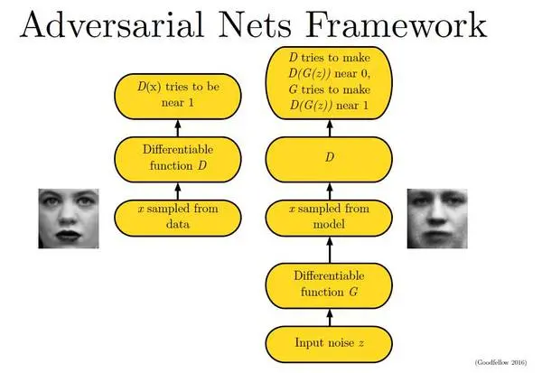
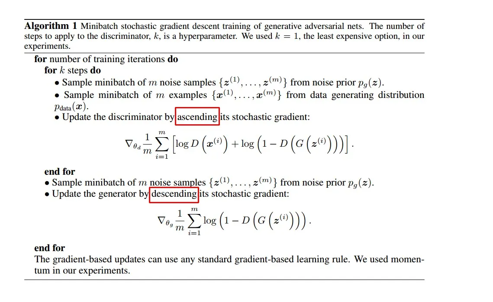
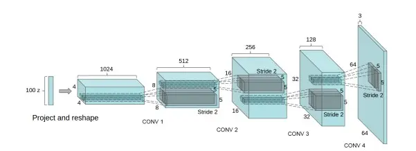

# GAN说明

GAN的核心概念十分简单，以生成图像为例解释。我们设有两个神经网络：生成器（G）和判别器（D）。

生成器（G）是一个网络，它接收一个随机噪声z，并利用这个噪声生成图像，表示为G(z)。
判别器（D）是另一个网络，它用于区分图像是否真实。它的输入是图像x，输出D(x)表示x为真实图像的概率。如果输出为1，则表示100%是真实图像；如果输出为0，则表示不可能是真实图像。

在训练过程中，生成器G的目标是尽可能生成逼真的图像以欺骗判别器D。而判别器D的目标是尽可能区分生成器G生成的图像和真实图像。这样，G和D形成了一种动态的“对抗”过程。

最终的结果如何呢？在理想情况下，生成器G能够生成非常逼真的图像G(z)，使得判别器D很难确定生成的图像是否真实，因此D(G(z)) ≈ 0.5。

这样，我们就达到了目标：得到一个生成式模型G，可以用来生成图像。

用随机梯度下降法训练D和G

这里红框圈出的部分是我们要额外注意的。第一步我们训练D，D是希望V(G, D)越大越好，所以是加上梯度(ascending)。第二步训练G时，V(G, D)越小越好，所以是减去梯度(descending)。整个训练过程交替进行。

CGAN（Conditional Generative Adversarial Networks）与传统的GAN在基本原理上相同，但引入了条件，以便生成特定类别的图像。在CGAN中，生成器和判别器的输入不仅仅是随机噪声，还包括条件信息，比如类别标签。

DCGAN（Deep Convolutional Generative Adversarial Networks）对卷积神经网络结构做了优化以提高生成图像的质量和训练的稳定性。主要的改变包括：

取消所有pooling层：因为pooling层可能导致信息丢失，所以DCGAN中使用转置卷积来进行上采样，以增加图像尺寸。

使用batch normalization：在生成器和判别器中都使用批归一化，有助于加速训练过程，并使网络更稳定。

去掉全连接层（FC）：将网络改为全卷积网络，这样可以处理任意大小的输入图像，并减少了参数数量，降低了过拟合的风险。

生成器使用ReLU和tanh：生成器网络中的激活函数采用ReLU来增加非线性，最后一层使用tanh函数将生成的像素值限制在[-1, 1]范围内，以匹配真实图像的像素值范围。

判别器使用LeakyReLU：判别器网络中的激活函数采用LeakyReLU，它可以在负值区域保留一定的激活，有助于减少梯度消失的问题，提高训练稳定性。

这些改进使得DCGAN在生成图像时能够产生更高质量的结果，并且在训练过程中更加稳定和收敛速度更快。

G网络：

