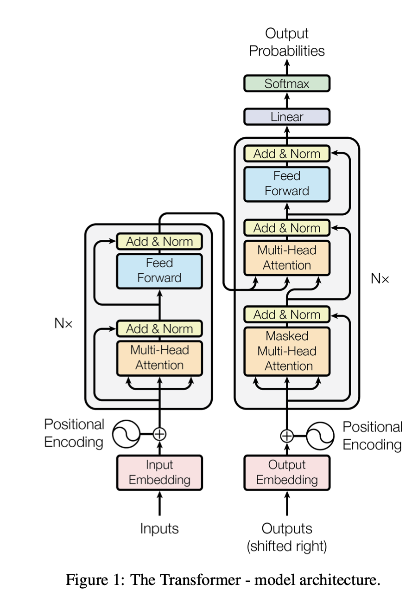

# Transformer技术细节以及Attention is all you need

## 概述

Transformer是一种基于自注意力机制的神经网络架构，广泛应用于自然语言处理任务。它通过并行计算和长距离依赖建模，克服了传统循环神经网络（RNN）的局限性。

## 主要组成部分

### 自注意力机制

Scaled Dot-Product Attention：
主要是可以除以根号d

自注意力机制允许模型在处理序列的每个位置时，动态地关注序列中其他位置的信息。通过计算查询（Query）、键（Key）和值（Value）之间的关系，自注意力机制能够捕捉全局依赖。

### 多头注意力

多头注意力通过多个并行的注意力头，分别从不同的子空间中提取信息，增强模型的表达能力和鲁棒性。

### 前馈神经网络

在注意力层之后，前馈神经网络对每个位置的表示进行非线性变换，进一步提升模型的复杂度和表达力。

### 残差连接与层归一化

**残差连接**帮助缓解深层网络中的梯度消失问题，通过在每个子层的输入和输出之间创建直接通道，使信息能够更容易地在网络中传递。

**层归一化(Layer Normalization)** 在每个样本的特征维度上进行归一化，稳定训练过程。与批归一化不同，层归一化不依赖于批量大小，因此在处理小批量或单一样本时表现更佳。它通过规范化每个神经元的输入，减少内部协变量偏移，加快收敛速度，提高模型的性能。

### Position encoding

## 优势

- **并行计算**：相比RNN，Transformer能够实现完全并行的计算，提高训练效率。
- **长距离依赖建模**：通过自注意力机制，Transformer能够有效捕捉长距离的依赖关系。
- **灵活性**：Transformer架构在各种任务中表现出色，具有很高的通用性。

## 应用

Transformer已成为自然语言处理领域的基石，广泛应用于机器翻译、文本生成、文本分类等任务。此外，许多预训练模型如BERT、GPT系列也基于Transformer架构。

### Reference ###

[text](https://github.com/hyunwoongko/transformer/tree/master)